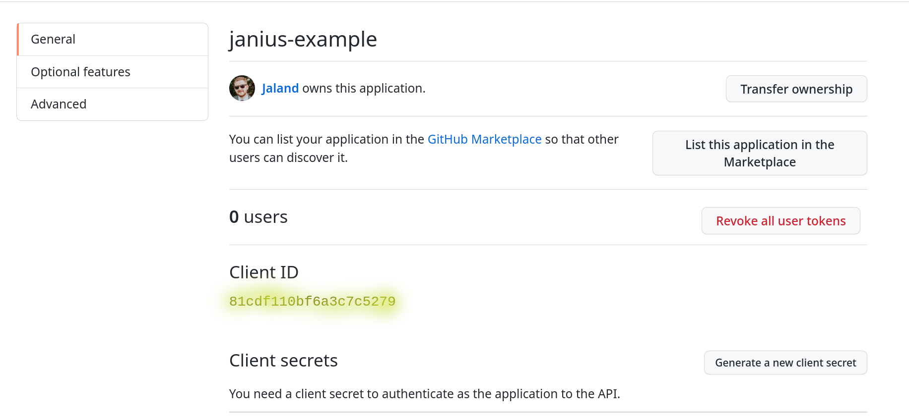
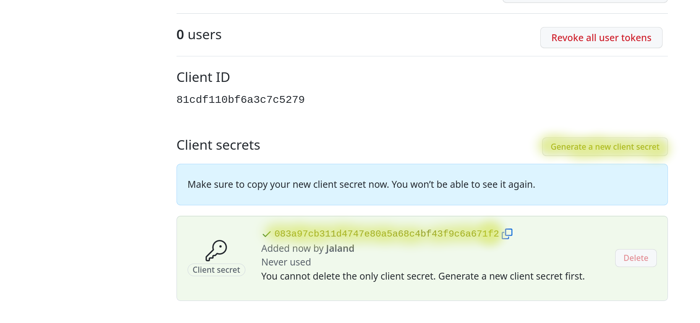

# Github oAuth apps

In order to use the full functionality of Assemble two oAuth applications need to be created, one for a `KeyCloak Identity Provider` and the other for the `Code Ready Workstation`.

## Creating An oAuth App

1. Both `oAuth Apps` are created the same way with slightly different inputs, use the following links for the two required apps:

      - [KeyCloak IDP oAuth Project](https://github.com/settings/applications/new?oauth_application[name]=janius-example&oauth_application[url]=https://assemble-demo.apps.[CLUSTER_DOMAIN]&oauth_application[callback_url]=https://keycloak-backstage.apps.[CLUSTER_DOMAIN]/auth/realms/backstage/broker/github/endpoint)
      - [CodeReady Workspaces oAuth Project](https://github.com/settings/applications/new?oauth_application[name]=janius-example&oauth_application[url]=https://devspaces.apps.[CLUSTER_DOMAIN]&oauth_application[callback_url]=https://devspaces.apps.[CLUSTER_DOMAIN]/auth/realms/backstage/broker/github/endpoint)

    !!! tip "Getting The Cluster Domain"
        Replace `[CLUSTER_DOMAIN]` with your cluster's domain. This can be found with the command `oc cluster-info | grep -Eo '.cluster(.*?).com` or copying the console url after `https://console-openshift-console.apps`

        Should look like `cluster-hn5gj.hn5gj.sandbox1544.opentlc.com`

1. Capture the Client Id  and save as the Environment Variable:

     - `GITHUB_OAUTH_CLIENT_ID` for the `KeyCloak IDP oAuth Project`
     - `CODE_READY_OAUTH_CLIENT_ID` for the `CodeReady Workspaces oAuth Project`

    **Retrieving Client ID**
    

1. Capture the Client Token and save as the Environment Variable:

     - `GITHUB_OAUTH_CLIENT_SECRET` for the `KeyCloak IDP oAuth Project`
     - `CODE_READY_OAUTH_CLIENT_SECRET` for the `CodeReady Workspaces oAuth Project`

    **Retrieving Client Token**
    
