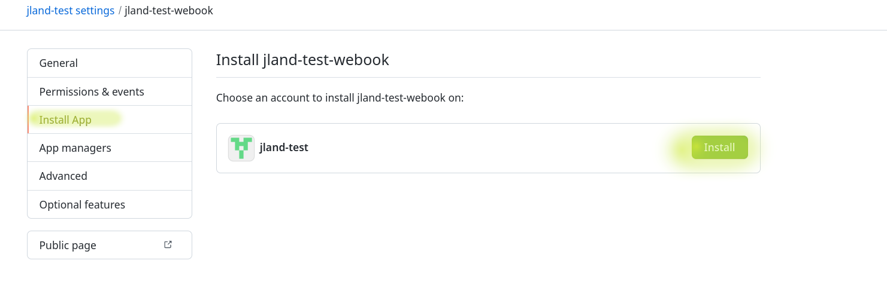
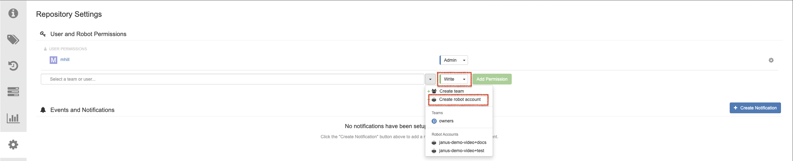
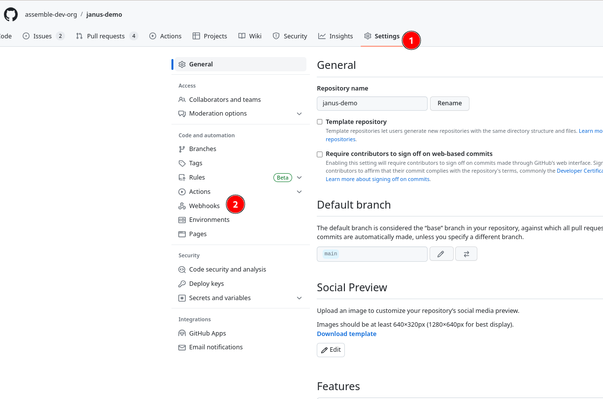
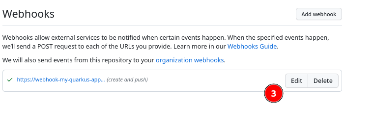

# Getting Started

!!! note
    This demo was developed with the [Janus IDP Demo](https://demo.redhat.com/catalog?search=janus&item=babylon-catalog-prod%2Fcommunity-content.com-janus-idp.prod) catalog item on the Red Hat Demo Platform as the intended target for deployment.  Though not supported, the full setup and demo should work on any OpenShift 4.12+ cluster.

## Instructional Video

<iframe src="https://drive.google.com/file/d/1TJZLEwKFJer5RMpKn3rh9w2ftYGChPtg/preview" width="100%" height="480" allow="autoplay"></iframe>

## Prerequisites

- [oc](https://docs.openshift.com/container-platform/4.12/cli_reference/openshift_cli/getting-started-cli.html) (4.11+)
- [ansible](https://www.ansible.com/)/[ansible-galaxy](https://galaxy.ansible.com/)
- [helm](https://helm.sh/)
    - Please use the version included with your Openshift Deployment
- [pip3](https://pypi.org/project/pip/)

## Install Packages

1. The Ansible `kubernetes.core` and `community.hashi_vault` collections need to be installed before using this playbook.

    ``` sh
    ansible-galaxy collection install kubernetes.core community.hashi_vault
    ```

1. The `kubernetes`, `openshift`, `hvac`, and `PyYAML` python packages need to be installed before using this playbook.

    ``` sh
    pip3 install --user kubernetes openshift hvac PyYAML
    ```

1. The `helm diff` plugin should to be installed before using this playbook.

    ``` sh
    helm plugin install https://github.com/databus23/helm-diff
    ```

## Configuration

Log in to your OpenShift cluster via the `oc` client.  Set the `OPENSHIFT_CLUSTER_INFO` variable for use later.

``` sh
export OPENSHIFT_CLUSTER_INFO=$(oc cluster-info | head -n 1 | sed 's/^.*https...api//' | sed 's/.6443.*$//' )
```

!!! tip "Using Linux?"
    If you are using a `Linux` environment, set the alias for the following commands to work:

    ``` sh
    alias open="xdg-open"
    ```

For the remaining environment variables, it may be preferable to make use of `./env.sh` file provided at the root of this project.  Fill in the listed env vars as you complete the setup configuration, then run `source ./env.sh`.

### Create GitHub Organization

Create a new [Github Organization](https://github.com/account/organizations/new?plan=free). This organization will contain the code repositories for the `components` created by Backstage.

The `GITHUB_ORGANIZATION` environment variable will be set to the name of the organization.

!!! tip
    You may also use any organization you are a member of, as long as you have the ability to create new repositories within it.

``` sh
export GITHUB_ORGANIZATION=
```

### Set Up GitHub Application

1. Create a new GitHub Application to use the `Git WebHooks` functionality in this demo.  The required field will be populated, and correct permissions set.

    ``` sh
    open "https://github.com/organizations/$GITHUB_ORGANIZATION/settings/apps/new?name=$GITHUB_ORGANIZATION-webhook&url=https://janus-idp.io/blog&webhook_active=false&public=false&administration=write&checks=write&actions=write&contents=write&statuses=write&vulnerability_alerts=write&dependabot_secrets=write&deployments=write&discussions=write&environments=write&issues=write&packages=write&pages=write&pull_requests=write&repository_hooks=write&repository_projects=write&secret_scanning_alerts=write&secrets=write&security_events=write&workflows=write&webhooks=write"
    ```

1. Set the `GITHUB_APP_ID` and `GITHUB_APP_CLIENT_ID` environment variables to the App ID  and App Client ID, respectively. Generate a new client secret and set the `GITHUB_APP_CLIENT_SECRET` environment variable.  Then, generate a `Private Key` for this app and **download** the private key file.  Set the `GITHUB_KEY_FILE` environment variable to the downloaded file, using either the absolute path or the path relative to the `ansible/cluster-setup` directory.
    ``` sh
    export GITHUB_APP_ID=
    ```
    ``` sh
    export GITHUB_APP_CLIENT_ID=
    ```
    ``` sh
    export GITHUB_APP_CLIENT_SECRET=
    ```
    ``` sh
    export GITHUB_KEY_FILE=
    ```

    

1. Go to the `Install App` table on the left side of the page and install the GitHub App that you created for your organization.

    

### Create Github OAuth Applications

Create an GitHub OAuth application in order to use GitHub as an Identity Provider for Backstage.

``` sh
open "https://github.com/settings/applications/new?oauth_application[name]=$GITHUB_ORGANIZATION-identity-provider&oauth_application[url]=https://janus-demo.apps$OPENSHIFT_CLUSTER_INFO&oauth_application[callback_url]=https://keycloak-backstage.apps$OPENSHIFT_CLUSTER_INFO/auth/realms/backstage/broker/github/endpoint"
```

Set the `GITHUB_KEYCLOAK_CLIENT_ID` and `GITHUB_KEYCLOAK_CLIENT_SECRET` environment variables with the values from the OAuth application.

``` sh
export GITHUB_KEYCLOAK_CLIENT_ID=
```

``` sh
export GITHUB_KEYCLOAK_CLIENT_SECRET=
```


Create a **second** GitHub OAuth application to enable Dev Spaces to seamlessly push code changes to the repository for new components created in Backstage.  

``` sh
open "https://github.com/settings/applications/new?oauth_application[name]=$GITHUB_ORGANIZATION-dev-spaces&oauth_application[url]=https://devspaces.apps$OPENSHIFT_CLUSTER_INFO&oauth_application[callback_url]=https://devspaces.apps$OPENSHIFT_CLUSTER_INFO/api/oauth/callback"
```

Set the `GITHUB_DEV_SPACES_CLIENT_ID` and `GITHUB_DEV_SPACES_CLIENT_SECRET` environment variables with the values from the OAuth application.

``` sh
export GITHUB_DEV_SPACES_CLIENT_ID=
```

``` sh
export GITHUB_DEV_SPACES_CLIENT_SECRET=
```

Create a **third** GitHub OAuth application to enable the numerous Backstage plugins utilizing GitHub to authenticate and access the relevant data.

``` sh
open "https://github.com/settings/applications/new?oauth_application[name]=$GITHUB_ORGANIZATION-backstage&oauth_application[url]=https://janus-demo.apps$OPENSHIFT_CLUSTER_INFO&oauth_application[callback_url]=https://janus-demo.apps$OPENSHIFT_CLUSTER_INFO/api/auth/github/handler/frame"
```

Set the `GITHUB_BACKSTAGE_CLIENT_ID` and `GITHUB_BACKSTAGE_CLIENT_SECRET` environment variables with the values from the OAuth application.

``` sh
export GITHUB_BACKSTAGE_CLIENT_ID=
```

``` sh
export GITHUB_BACKSTAGE_CLIENT_SECRET=
```

### Optional: Create Quay Repository

Providing a Quay repository will allow the user to demonstrate pushing to an external image registry, as well as the functionality of the Quay plugin in Backstage.

Create an organization in Quay, if one is not already available to use.

``` sh
open "https://quay.io/organizations/new/?namespace=$GITHUB_ORGANIZATION"
```

Create a repository for each application to be instantiated through Backstage, ensuring that it is in the specified organization, and that the visibility is set to public.

``` sh
open "https://quay.io/new/?name=YOUR_APP_NAME"
```


Under `Repository Settings -> User and Robot Permissions`, create a new robot account with write permission to the repository.



Set the `JANUS_QUAY_USER` and `JANUS_QUAY_TOKEN` environment variables to the username and token of the robot account.


``` sh
export JANUS_QUAY_USER=
```

``` sh
export JANUS_QUAY_TOKEN=
```
## Install

Clone the `demo-setup` repo and run the next commands from inside of the `ansible/cluster-setup` directory

```sh
git clone https://github.com/janus-idp/demo-setup.git
cd demo-setup/ansible/cluster-setup
```

### Run the Software Templates Setup Playbook

Fork the [Software Templates](https://github.com/janus-idp/software-templates/fork) repository to your organization. Ensure that the name of the forked repo remains as `software-templates`

Execute the following command to complete setup of the fork. This playbook will customize your fork of the Software Templates repo with relevant information pertaining to your cluster, and mimic the structure of a custom template being used in an enterprise IT environment.

```sh
ansible-playbook ./template.yaml
```

### Run the Cluster Setup Playbook

The Inventory values in `inventory/group_vars/all.yml` can be changed, but it is not required

Run Command:

``` sh
ansible-playbook site.yaml -i inventory
```

!!! note
    The deployment of most infrastructure is delegated to ArgoCD.  Once the playbook successfully runs, it may take several minutes until the demo is fully operational. The deployment can be monitored in the ArgoCD console.

The cluster is now set up to run the Janus IDP Demo. Please refer to the [Architecture](../architecture/) and [Demo](../demo/) sections for further guidance. 

To create a local copy of the requisite environment variables for future use, run the following command:

``` sh
echo "export GITHUB_ORGANIZATION=$GITHUB_ORGANIZATION

export GITHUB_APP_ID=$GITHUB_APP_ID
export GITHUB_APP_CLIENT_ID=$GITHUB_APP_CLIENT_ID
export GITHUB_APP_CLIENT_SECRET=$GITHUB_APP_CLIENT_SECRET
export GITHUB_KEY_FILE=$GITHUB_KEY_FILE

export GITHUB_KEYCLOAK_CLIENT_ID=$GITHUB_KEYCLOAK_CLIENT_ID
export GITHUB_KEYCLOAK_CLIENT_SECRET=$GITHUB_KEYCLOAK_CLIENT_SECRET

export GITHUB_DEV_SPACES_CLIENT_ID=$GITHUB_DEV_SPACES_CLIENT_ID
export GITHUB_DEV_SPACES_CLIENT_SECRET=$GITHUB_DEV_SPACES_CLIENT_SECRET

export GITHUB_BACKSTAGE_CLIENT_ID=$GITHUB_BACKSTAGE_CLIENT_ID
export GITHUB_BACKSTAGE_CLIENT_SECRET=$GITHUB_BACKSTAGE_CLIENT_SECRET" > env.sh
```

### Troubleshooting

??? question "Stuck on `FAILED - RETRYING: [localhost]: Wait for Keycloak to be Ready (xxx retries left)` for over 2 minutes"
    Bounce the pod deployed by the `keycloak` StatefulSet in the `backstage` namespace.  The playbook will pick up again once the new pod is up.

??? question "Failed on `Run RHSSO Backstage Helm Chart` during initial run `no matches for kind \"Keycloak\" in version...`"
    The RHSSO operator may not have completed installation, try rerunning the Ansible Playbook.

??? question "Log in to Argo Cluster"
    To access the console, the password for the `admin` user can be found in the `argocd-cluster` secret.

??? question "Failed on `Fetching Default Service Account Token` with `unknown command \"token default\"`"
    Ensure your `oc` client is 4.11 or above
    ```sh
    oc version --client
    ```
    The latest `oc` client can be downloaded here:
    ```sh
    open "https://console-openshift-console.apps$OPENSHIFT_CLUSTER_INFO/command-line-tools"
    ```
## Setup for Previously Run Demo
If you previously run a demo and want to use the same GitHub Organization and repostiories you can.  Janus will discover previous repositories and automatically add them to the catalog.  In order to create the Argo CD resources, OpenShift namespaces and Tekton pipelines, follow the steps below:

### Set your Environment Variables
Make sure properly set all your environment variables as described in the Configuration section above.  This includes the setting of the `OPENSHIFT_CLUSTER_INFO`

### Update GitHub OAuth Apps
Update all OAuth apps created in the Configuration section above with the new cluster URL.


### Update Software Templates
Make sure your `$GITHUB_ORGANIZATION/software-templates` repository is up-to-date to ensure you get the latest features in the templates.  To do this, either hit the "Sync fork" button, delete and re-clone the repo as described in the first step [here](#run-the-software-templates-setup-playbook) or run the following commands:

```bash
git fetch upstream

git checkout main

git merge upstream/main
```

### Run Ansible Playbooks
Run both playbooks as described in the [`Run the Software Templates Setup Playbook`](#run-the-software-templates-setup-playbook) and [`Run the Cluster Setup Playbook`](#run-the-cluster-setup-playbook) sections above

### Clone the XXX-gitops repo(s)
1. Clone your `-gitops` repo.
2. Update the `helm/build/values.yaml` by changing the `app.cluster` value to match your new cluster URL and commit the change
3. Create the Argo CD resources by running the following command from the root of the `-gitops` repo
```
oc apply -f ./argocd
```
Repeat the above steps for as many `-gitops` repos you have in your Organization

### Update Webhooks
Update the Webhooks for all of the source repos in your GitHub Organization

Click on the Settings tab for your source repo and then click `Webhooks` on the left hand side



Click the `Edit` button next to the webhook



Update the `Payload URL` with your new cluster URL and click the `Update webhook` button at the bottom of the page


Repeat for as many source repos as you wish.